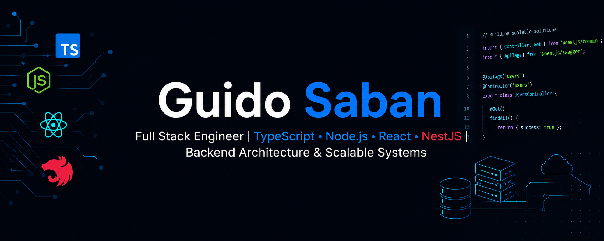
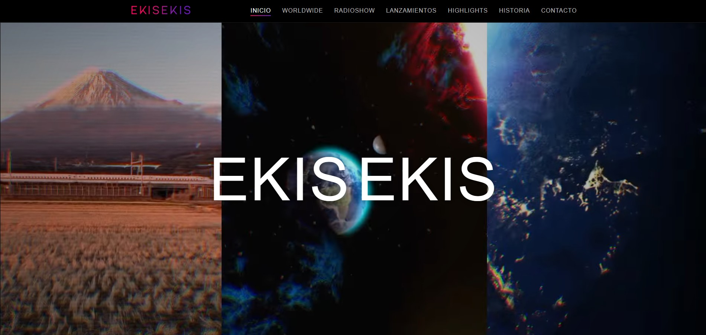
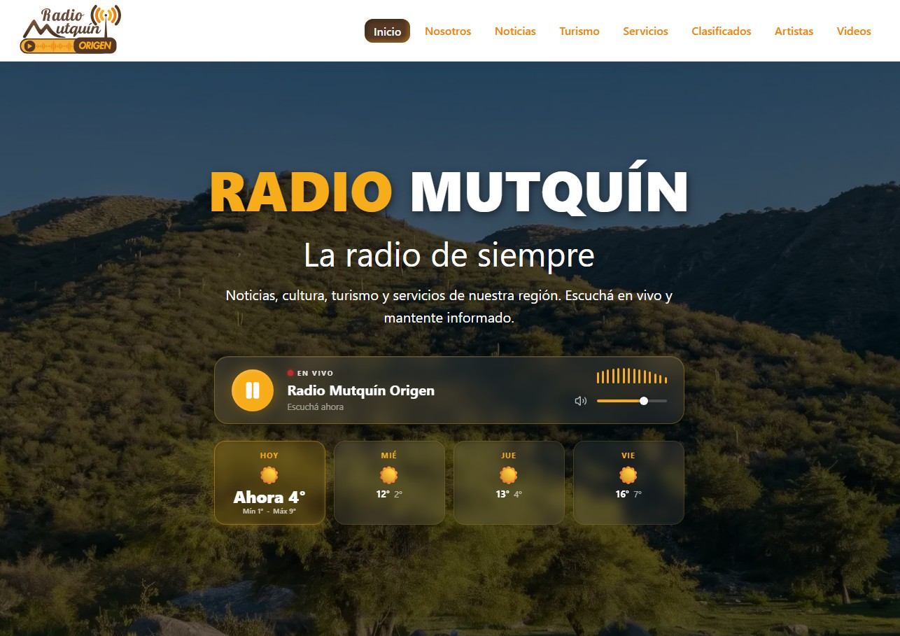
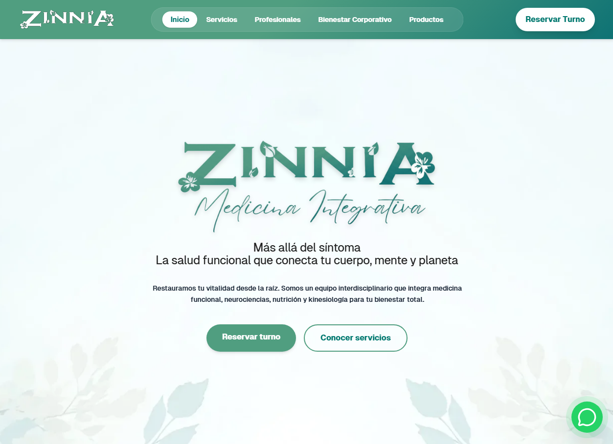
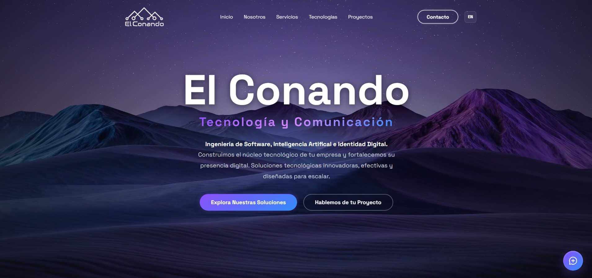

<h1 align="center">👋 ¡Hola! Soy Guido José Saban</h1>

<h3 align="center">Full Stack Developer | Node.js, React, TypeScript</h3>

📍 Buenos Aires, Argentina

---

## 👨‍💻 Sobre mí

Soy un **Full Stack Engineer** especializado en el ecosistema TypeScript (Node.js, React, NestJS). Me apasiona transformar necesidades complejas de negocio en software eficiente, con un fuerte enfoque en el diseño de arquitecturas escalables, automatización de procesos y rendimiento web.

- 💼 Actualmente trabajando como Freelance Full Stack Developer.
- 🎓 Cursando la Ingeniería de Sistemas en la Universidad Argentina de la Empresa (UADE).
- ⚙️ Experiencia comprobable en automatización de flujos operativos (reduciendo carga manual hasta un 90%) y en la creación de APIs REST robustas.

---

## 🚀 Proyectos Destacados

<table border="0" style="width: 100%; border-collapse: collapse;">
  <tr>
    <td width="50%" align="center" valign="top">
      
        
      <h3>🎧 Ekis Ekis Music</h3>
      
Hub digital para un proyecto de alcance internacional en la escena electrónica. Integra navegación mediante mapa interactivo y centraliza todo el catálogo musical del artista.

      

        
        
        
      

      

        <a href="https://ekisekismusic.com/"><strong>🔗 Explorar Proyecto</strong></a>
      

    </td>
    <td width="50%" align="center" valign="top">
       
      
        
      <h3>📻 Radio Mutquin Origen</h3>
      
Plataforma web integral para emisora online. Conecta la transmisión de audio ininterrumpida con secciones dedicadas a noticias, material cultural, clasificados y exposición de servicios.

      

        
        
        
      

      

        <a href="https://radiomutquinorigen.com/"><strong>🔗 Explorar Proyecto</strong></a>
      

    </td>
  </tr>
  <tr>
    <td width="50%" align="center" valign="top">
      
        
      <h3>🌿 Zinnia Medicina Integrativa</h3>
      
Ecosistema digital para centro de medicina integrativa. Centraliza cartilla de profesionales, planes corporativos, exhibición de servicios médicos y catálogo e-commerce integrado.

      

        
        
        
      

      

        <a href="https://zinniamedicinaintegrativa.com/"><strong>🔗 Explorar Proyecto</strong></a>
      

    </td>
    <td width="50%" align="center" valign="top">
      
        
      <h3>🤖 El Conando</h3>
      
Ecosistema digital para centro de medicina integrativa. Centraliza cartilla de profesionales, planes corporativos, exhibición de servicios médicos y catálogo e-commerce integrado.

      

        
        
        
      

      

        <a href="https://elconando.com/"><strong>🔗 Explorar Proyecto</strong></a>
      

    </td>
  </tr>
</table>

---

## 🛠️ Tecnologías y Herramientas

### Lenguajes

### Frontend

### Backend & APIs

### Bases de Datos

### Cloud & Infraestructura

---

## 📫 Conecta conmigo

  
  

